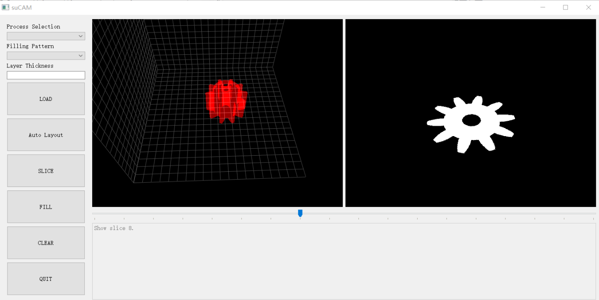

### Introduction
多轴打印路径规划系统目的是提供一个独立的，针对多轴打印的空间填充路径生成工具，目前只能提供平面的填充方式。

### How to use
基本代码已经上传到GitHub的suCAM目录。
- 在使用前注意先安装以下工具和python库
1. install Git bash
2. install Anaconda

- 安装相应工具包
作为探索性的代码，本系统界面的构建依赖于Qt，PyQtgraph，stl的读取依赖于numpy-stl,划分依赖于stl2png；路径生成和优化依赖于opencv、clipper实现。

In git bash window
```
pip install pyqt5
pip install git+https://github.com/pyqtgraph/pyqtgraph
pip install pyOpenGL
pip install numpy-stl
pip install opencv-python
```
3. run "python suCAM.py"

### Method

#### 1. 三角网格模型的处理
三角网格的处理包括流形检测、打印方向判定、区域划分。在单轴打印时，打印方向暂由手工制定。

#### 2. 切片
暂时采用stl2png完成。
https://bitbucket.org/goatchurch/barmesh/src/1e2782de8433?at=master

#### 3. 切片路径填充
todo：轮廓向内平移，生成填充路径，变化为连续Fermat's curve 填充。

填充路径生成使用clipper lib 或参考
奥地利萨尔茨堡萨尔茨堡大学的计算机科学专业的[丁赫尔德](https://www.cosy.sbg.ac.at/~held/held.html)通过曲线多边形的Voronoi图计算偏移曲线的[方法](https://ac.els-cdn.com/S0010448597000717/1-s2.0-S0010448597000717-main.pdf?_tid=63fe7c5c-f78a-45a4-9f1f-1986e8f51377&acdnat=1543315797_4f2cb569a0acb261dfd7a5dff27d52c3)。

生成连续路径，并提高增强纤维路径平滑性的方法参考费马螺线的生成方法。

#### 4.适用于5轴与六轴打印的空间填充与路径生成方法
todo：自动生成层间连续路径和g-code。


